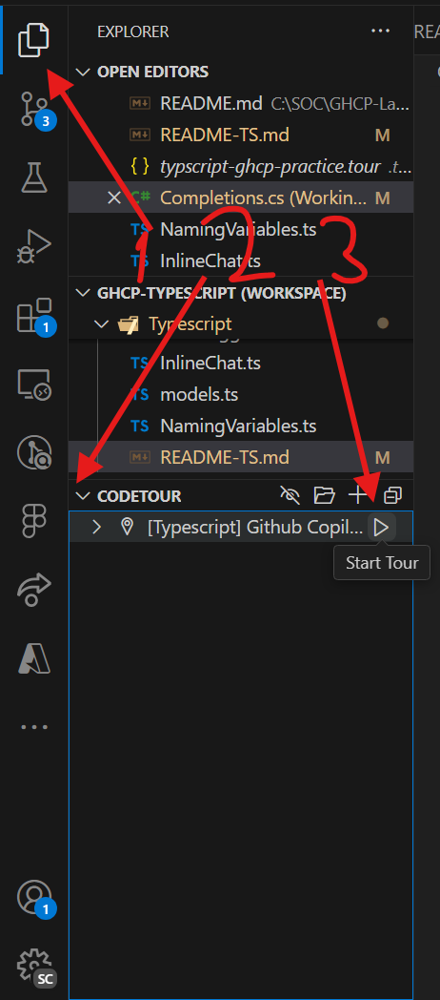

# Github Copilot Lab

Welcome to the Github copilot (GHCP) lab.

For easier reading, you can preview this file as Markdown using `Ctrl+Shift+V`,
it may need a moment to open render. 

## What will we learn in this lab?
- At the end of this lab you will know the differences between Github Copilot chat, inline chat, and completions and even edits. And you'll learn when to use which one.
- You will learn about GHCP aliases (`@` / `#`) and slash commands for Github Copilot Chat and inline.
- You will learn how to be more proficient with your completions and how to get it right on the first try 🥇
- You will learn about the GHCP suggestions panel.
- How to utilize context to the fullest so that Github Copilot gives you what you want. 

*This lab **shouldn't take more than 60 minutes**. 
Take a look at the clock. If you reach more than 30 minutes, I suggest you stop and wait for the learning session*

There are two tracks, the [Typescript](./GHCP-Typescript.code-workspace) track and the [dotNet](./GHCP-dotNet.code-workspace)** track, choose the one that suits you best, or do both!

Each workspace has recommended extensions that you need to install to be able to run the code, you can run those.

## How will we learn it? 
Using the CodeTour extension, you will be prompted with questions which will help you shift your programming paradigm, allowing you to use Github Copilot more effectively. The text in CodeTour is outside the Github Copilot context (which you will learn more about during this lab).

 At times, you'll also read through Github Copilot tips, tricks and educational material.

## Pre-requisite:
Have the extensions Copilot and Copilot Chat installed.
If you don't have them installed, follow the installation instructions at [https://aka.ms/copilot](https://aka.ms/copilot).

## Terminology and tips:
- Completions is the "ghost text" (gray) that appears in your editor after you start typing
  1. Clicking `Tab` will accept the entire text (there may be more suggestions once you accept the first one or jump to a new line)
  2. Clicking `Ctrl + Right arrow` will accept the next word only!
  3. When a completion is showing up, you can click `Ctrl + Enter` to open a panel with several suggestions 
- Inline chat is the experience where you have a small chat window that appears in the editor. You can make change requests, ask questions and get answers from GHCP, all in the editor window.
- Chat is the experience where you have a full chat window that appears next to the editor (usually on the right side). Answers you receive here won't affect your code in the editor.
- In GHCP, **Context Is Everything**. Starting from your selection, to the open files in your IDE and most importantly- to what aliases / commands you're asking GHCP to do include in your prompt's context.
- You can use backticks "`" for variable / function names to provide more context
- Using Up/down in the Chat or Inline chat navigates between prompt history, so you don't have to retype it all.

## How to participate:
1. Double click the relevant workspace and hit the "Open Workspace" button in the Editor (bottom right)
    1. `GHCP-dotNet.code-workspace` for dotNet developers
    2. `GHCP-Typescript.code-workspace` for Typescript developers
    2. `GHCP-cpp.code-workspace` for C++ developers
    
2. Install recommended extensions from the workspace
    1. If you don't want to run the code, CodeTour is the critical one
3. Start the tour by clicking on tour Panel, then hit the the Play icon button to start.

4. Click the next (or previous) buttons to navigate the code tour once you're ready to move on, or need to take another look in a previous step.

Feel free to reach out with improvement suggestions, feedback, or anything that you may come up with to @Yomanor.

** *But I'm a DotNet developer, why would I use VS Code?*
  *Using VS Code is mandatory as it has the Code tour extension which guides you through the learning. The Code tour instructions aren't included in GHCP context If they were, you'd get completions to everything and be done in 3 minutes!*
