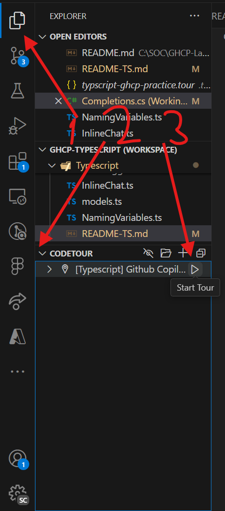
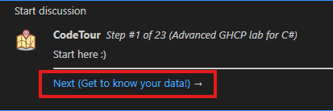

# Github Copilot Lab

Welcome to the Github Copilot lab C++ track!

There is no need to run the code in this lab, you can follow the tour and learn about Github Copilot. 
If you'd like to see the results, you can simply log the results to console and see if you've answered the question correctly.

## How to participate:
1. Install recommended extensions from the workspace
	1. If you don't want to run the code, **CodeTour is the critical one**
1. To start the tour:
	1. Navigate to the file explorer panel
	1. Locate the Code tour subsection and open it from the very bottom
	1. Hover over the tour name and hit the the Play icon button to start. 

	

1. Click the next (or previous) buttons to navigate the code tour once you're ready to move on, or need to take another look in a previous step.

Feel free to reach out with improvement suggestions, 
feedback, or anything that you may come up with to @Yomanor.

