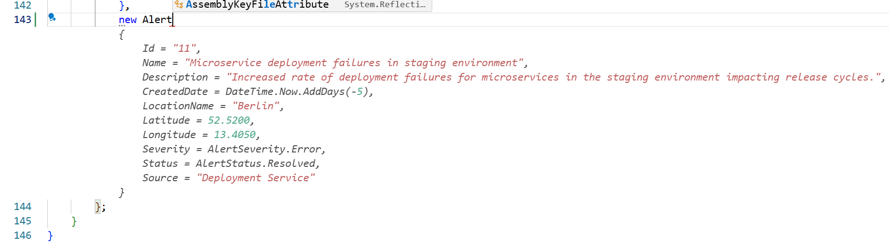
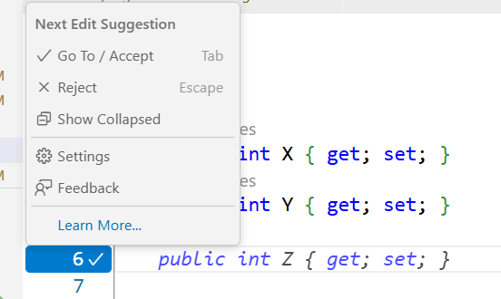
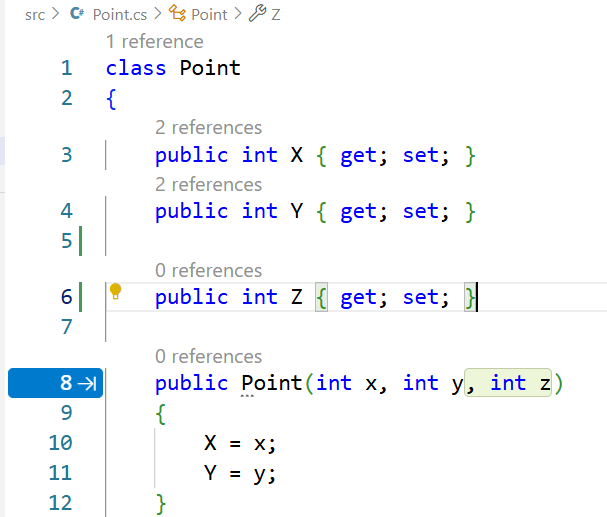
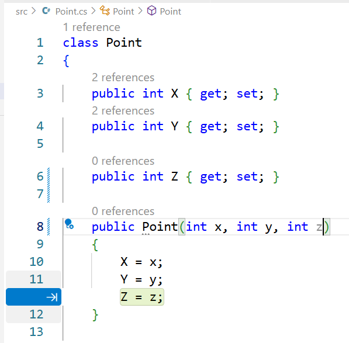
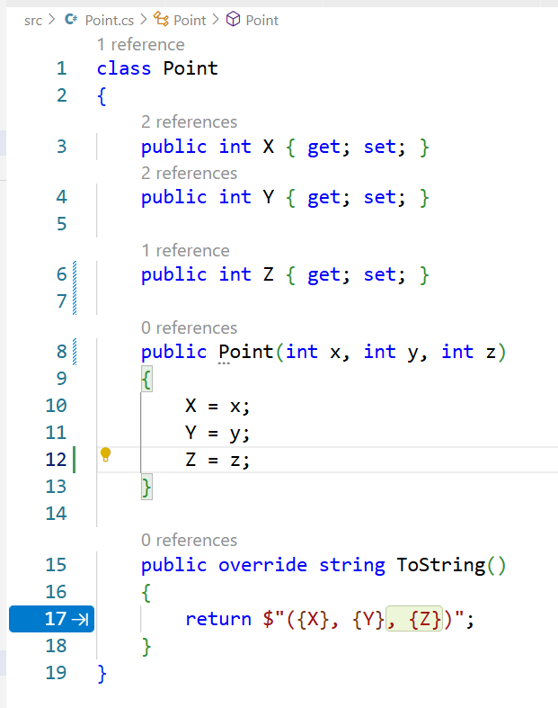
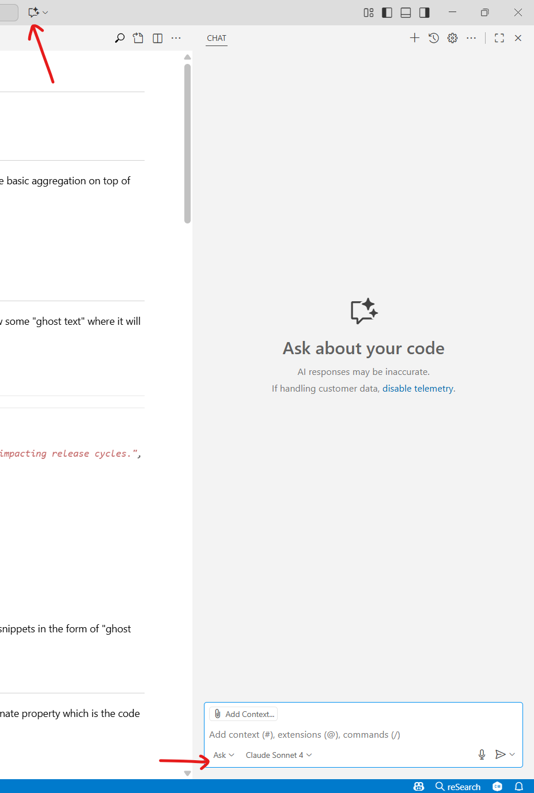
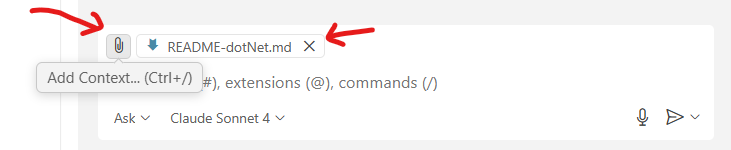
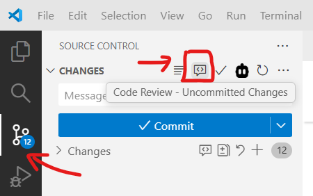
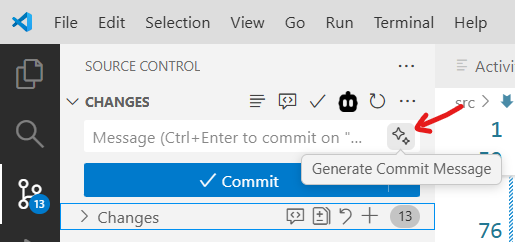

# Github Copilot Lab (.NET)

Welcome to the Github Copilot lab C# .NET track! To participate follow through the exercises listed below.

## 1. Get to know the application

We will be working on a very basic Alert Management System which will be a console application to view a list of (mocked) alerts and perform some basic aggregation on top of them to get some insights.

Take a look at [Alert.cs](./Alert.cs) file which is the model for our alert.

Take a look at [MockedAlerts.cs](./MockedAlerts.cs) file which contains a list of mocked alerts. This is the data we will be building upon.

## 2. Code completions

Go to [MockedAlerts.cs](./MockedAlerts.cs), and at the end of the 10th alert, enter an new line and type `new Alert`. As soon as you do this GitHub Copilot would show some "ghost text" where it will try to suggest a new alert based on the theme of alerts in your existing file.

It might look something like -



This is one of the most basic features of GitHub Copilot called `Code completions` by which it will read your existing file, and try to suggest code snippets in the form of "ghost text" which is the greyed out text.

## 3. Next Edit Suggestions

Another form of code completions feature is the `Next Edit Suggestions` feature. Open [Point.cs](./Point.cs) file, and below the declaration for the `Y` coordinate property which is the code `public int Y { get; set; }`, add two new lines (as if you were about to add the Z coordinates).

You should see a suggestion from GitHub Copilot that you can accept to add the Z coordinate property -



Now, using your mouse you can just click on the blue banner covering the line number on the left, or select `Go To / Accept` option in the menu which opens when you hover above it.

As you keep clicking accept, GitHub Copilot will predit some more immediately upcoming edits -







## 4. Ask Mode

Go to [AlertAggregations.cs](./AlertAggregations.cs) file. Here we will write some aggregation functions to extract some insights from our alerts data. This time let's Ask GitHub Copilot on what aggregations we should have.

In VSCode, on the top right beside the search bar there is a `Toggle Chat` icon. Click on it to open a GitHub Copilot chat window. Ensure that you have `Ask` mode selected on the bottom left corner.



This is where AI models come into the picture. You can select any AI model (like Claude Sonnet, Gemini, GPT 5, etc) of your choice. In my experience, Claude Sonnet models are great at generating code, GPT models are great for analysis and brainstorming.

Paste the prompt below in the chat box and hit Enter -

```
Examine my data which is a list of Alerts in MockedAlerts.cs file. In the current AlertAggregations.cs file, I want to add some aggregation functions which take these list of mocked alerts as inputs and perform some aggregations over the Alert properties. Suggest at least 5 such aggregations.
```

This should make GitHub Copilot analyze your code for a while and suggest the aggregations with code snippets. You can select `Apply` on the top right section of the proposed code snippets to add those changes to your file.

Ask mode is very useful to ask questions about your codebase to GitHub Copilot, or brainstorm some ideas with it.

## 5. Learning how to write effective prompts

**Prompt engineering** - is the process of crafting clear instructions to guide AI systems like GitHub Copilot into generating accurate responses.
   - While drafting prompts it is important to [follow the 4 S Principle](https://learn.microsoft.com/en-us/training/modules/introduction-prompt-engineering-with-github-copilot/2-prompt-engineering-foundations-best-practices) - Single, Short, Specific, Surround.

Being able to write well crafted prompts is a muscle we need to build, and we can only build that by practicing! So keep playing around with the GitHub Copilot chat window and examine how changes in your prompt is improving the responses.

**Context** is key when it comes making sure AI tools generate accurate responses. By default, [GitHub Copilot takes some context from various sources](https://learn.microsoft.com/en-us/training/modules/introduction-prompt-engineering-with-github-copilot/3-github-copilot-user-prompt-process-flow) like -
   - Cursor position, currently opened files, other files opened in the IDE, project files as neccessary.

You can add or remove files which GitHub Copilot takes into context by manipulating the file selection -



You can also manipulate the context by using the `#` / `@` / `/` operators. Try out these operators in the chat box and examine the drop down options which it provides. Some of the most useful ones are - `#codebase`, `/tests`, `/explain`.

**Custom instructions** is a file which is added to each and every prompt sent to GitHub Copilot implicitly. This is stored in the [.github/custom-instructions.md](../.github/copilot-instructions.md) file. This is a great place to store the coding standards or other guidelines specific to your project so that GitHub Copilot produces results more accurate in the context of your project.

## 6. Agent Mode

GitHub Copilot agent mode is the next evolution in AI-assisted coding. Acting as an autonomous peer programmer, it performs multi-step coding tasks at your command — analyzing your codebase, reading relevant files, proposing file edits, and running terminal commands and tests.

Go to [Program.cs](./Program.cs) file. Here, open the GitHub Copilot chat window and switch to Agent mode. Paste the prompt below in the chat box and hit Enter -

```
I want to implement an interactive console application for my alert management system. When the app is run, it should display a menu with options to select. The first option should be to list all alerts, second option should be to exit the program, the rest of the options should be to invoke the various aggregation functions defined in AlertAggregations.cs - there should be 1 option in the menu for each aggregation function in the AlertAggregations.cs file.
```

Agent mode should automatically draft a plan, and make edits systematically and also figure out how to run your project and spawn a terminal to ensure your project build succeeds.

## 7. Code Reviews

GitHub Copilot can review your code changes locally so that you get an AI expert to review your code even before committing the changes.

For this, select the `Source Control` option in the left sidebar menu in VSCode, and click the Code Review bubble icon -



You can also ask GitHub Copilot to generate a commit message for you -



## 8. Other GitHub Copilot features

Some other cool GitHub Copilot features are -

1. [GitHub Copilot CLI](https://github.com/features/copilot/cli) - Work with Copilot from the comfort of your terminal.
2. [GitHub Copilot Spaces](https://docs.github.com/en/copilot/concepts/context/spaces) - Copilot Spaces let you organize the context that Copilot uses to answer your questions. Similar to a knowledge base.
3. [GitHub Copilot Spark](https://github.com/features/spark) - Transform ideas into full-stack applications.
4. [GitHub Copilot Coding Agent](https://docs.github.com/en/copilot/concepts/agents/coding-agent/about-coding-agent) - Assign a GitHub issue to Copilot and have it create a PR.